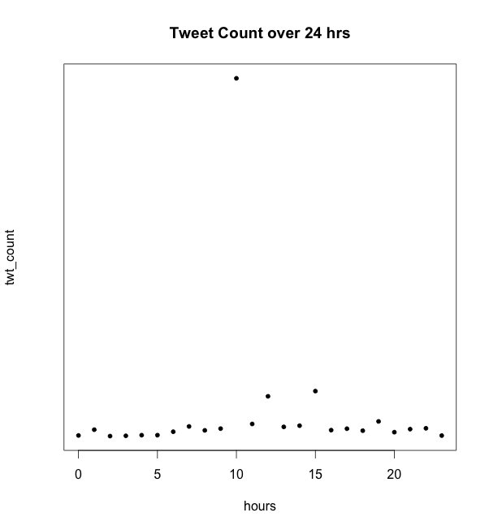
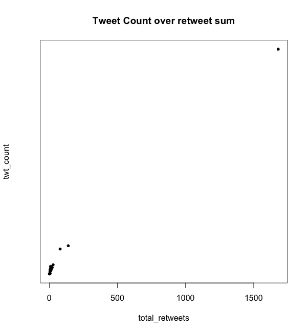
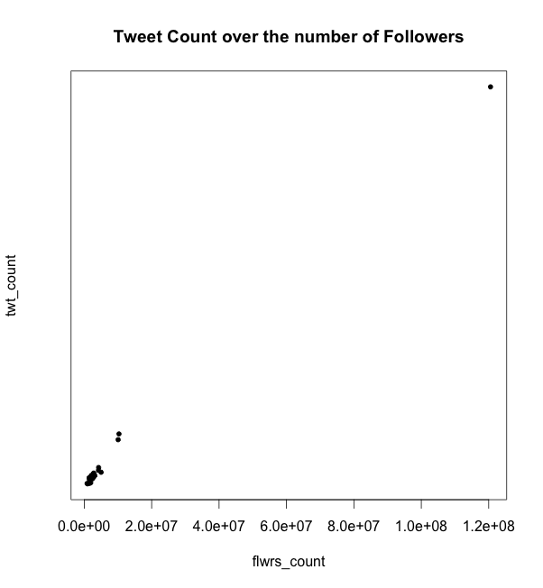
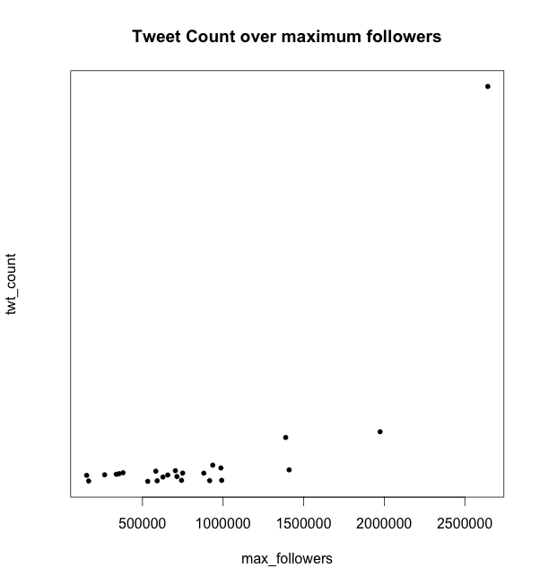
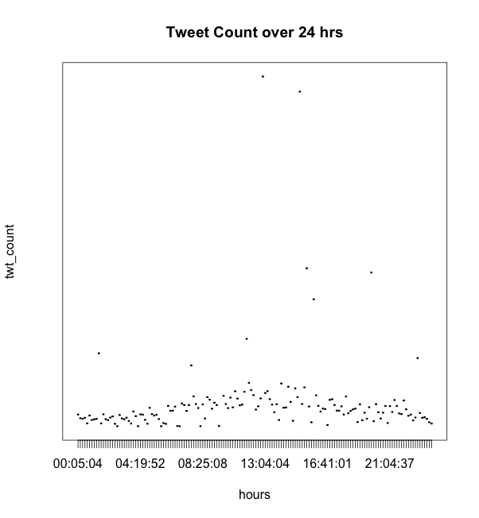
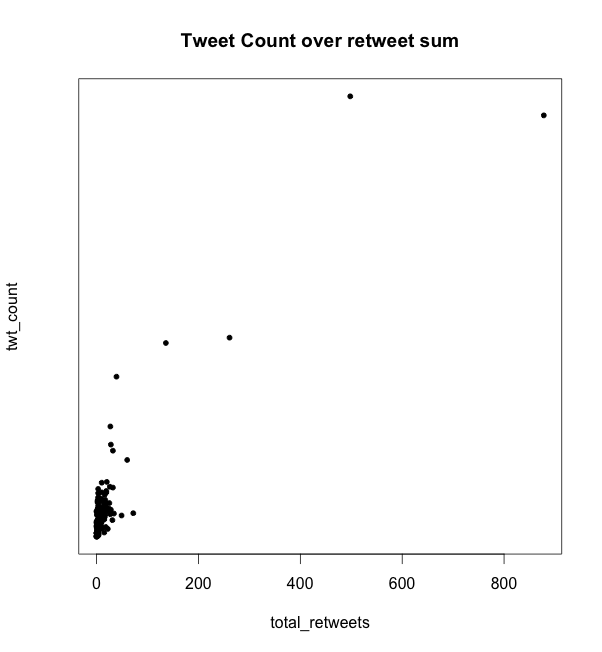
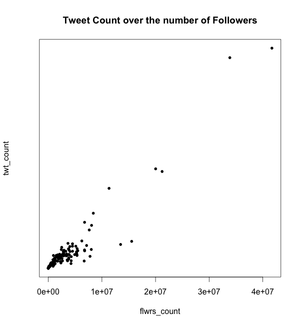
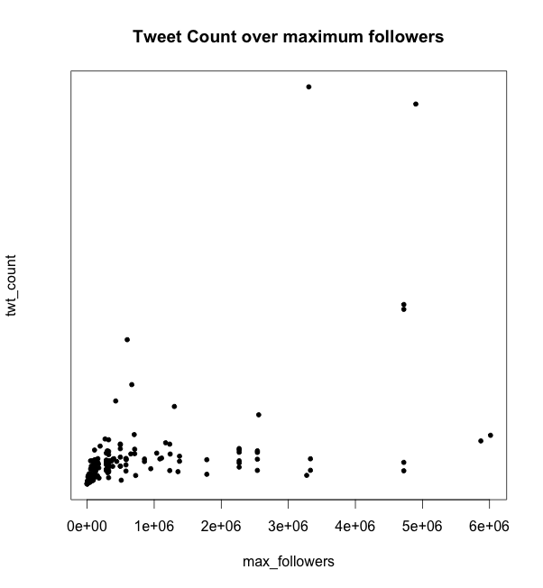

===================
Problem Formulation
===================

Question 2
**********

::

  python was used for data parsing and R Statistical language was used for data and regression analysis

1. Problem Formulation
-------------------

* Predicting the number of tweets in the next hour based on
  previous hours data.

  - **Output**:

    * Expected number of tweets

  - **Input**:

    * Desired hour of expectation
    * Total number of retweets at that hour
    * Total number of retweets within that hour
    * Total number of follows of all users who used the hashtag

2. Data Collection
---------------

* The python ``get_stats`` in ``project3.py`` method parses the data such
  that it sums up the tweets data for every hour as follows:

  - Total number of tweets
  - Total number of retweets
  - Total number of followers for all tweets withing an hour
  - Maximum number of tweets within an hour
  - The hour in which the above data were collected at

3. Initial Data Analysis
---------------------

* Before forming our regression model, we first did some exploration
  of the data in order to find the best way to prepare the data for
  the model.
* After some data exploration, we saw that the best data formulation
  for the regression model is as follows:

  - Since we want to predict the number of tweets in a specific hour
    of the day regardelss of the date, we first sort the data
    chronologically in hour bins regardless of the date as shown below.
  - For each time bin, we average all data such that for each hour bin
    (24 bins), we have averages of the total number of tweets, total
    number of retweets, total number of followers, and total maximums
    of followers that occured within that hour.

4. Data Exploration
-------------------

* This step aims to identify outliers and irregularities in the data.
* We first plot the number of tweets across each of the four input
  variables in `1. Problem Formulation`_ as shown below:

|img1| |img2|

|img3| |img4|

* From the figure above, it is clear that the exists one significant
  outlier that does not mesh well with the rest of the data. Therefore,
  we eliminitate this particular data. replotting the data we get a
  better sparsed plots as shown below

|img1| |img2|

|img3| |img4|

.. +------------------+--------------------+---------------------+-----------------------------+------+
.. | number of tweets | number of retweets | number of followers | maximum number of followers | hour |
.. +==================+====================+=====================+=============================+======+
.. | 432              | 23                 | 234089              | 11100234                    | 1    |
.. +------------------+--------------------+---------------------+-----------------------------+------+
.. | 432              | 23                 | 234089              | 11100234                    | 1    |
.. +------------------+--------------------+---------------------+-----------------------------+------+
.. | 432              | 23                 | 234089              | 11100234                    | 1    |
.. +------------------+--------------------+---------------------+-----------------------------+------+
.. | 8                | 5                  | 2323                | 7677                        | 2    |
.. +------------------+--------------------+---------------------+-----------------------------+------+
.. | 67               | 8                  | 236                 | 454                         | 2    |
.. +------------------+--------------------+---------------------+-----------------------------+------+
.. | 9                | 7                  | 97                  | 676                         | 2    |
.. +------------------+--------------------+---------------------+-----------------------------+------+
.. | ...              | ...                | ...                 | ...                         | ...  |
.. +------------------+--------------------+---------------------+-----------------------------+------+
.. | 76               | 234                | 12                  | 11100234                    | 23   |
.. +------------------+--------------------+---------------------+-----------------------------+------+
.. | 566              | 76                 | 123                 | 12312                       | 23   |
.. +------------------+--------------------+---------------------+-----------------------------+------+
.. | 56               | 5                  | 12312               | 346345                      | 23   |
.. +------------------+--------------------+---------------------+-----------------------------+------+

