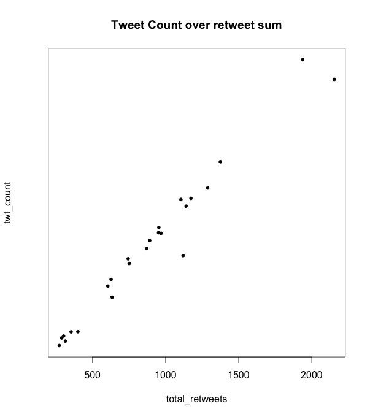
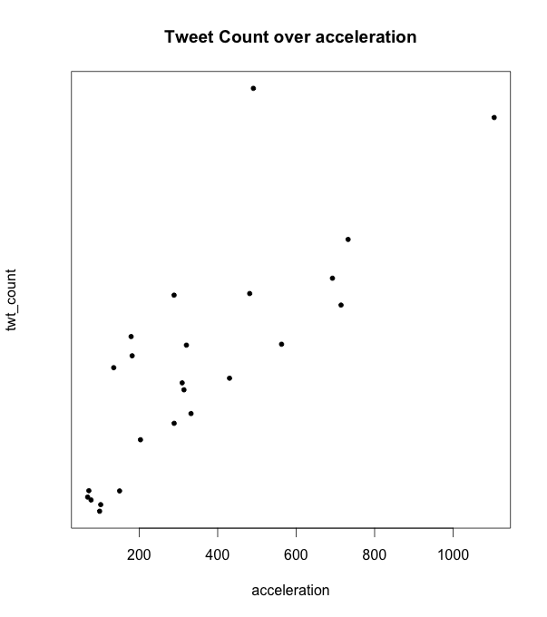
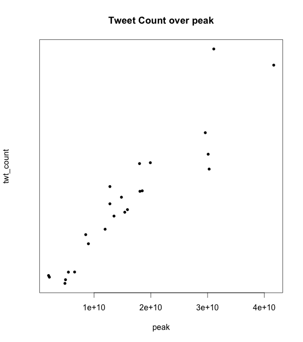
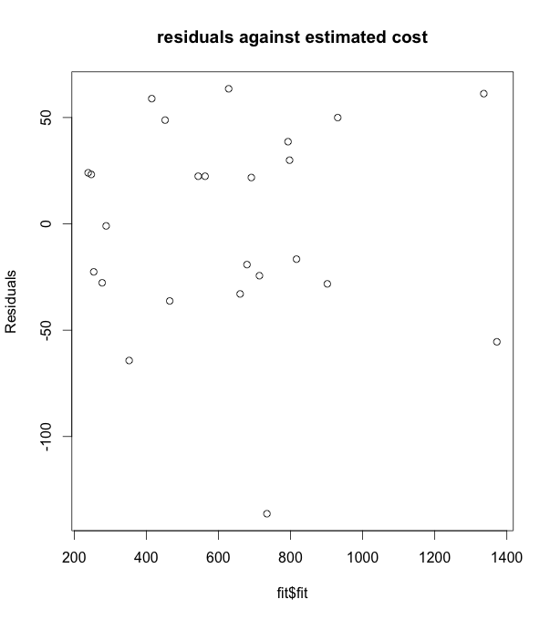

===================
Question 3
===================

::

  python was used for data parsing and R Statistical language was used for data
  and regression analysis

We're going to skip the analysis done in question 2 and reduce our steps to:
Data Exploration, Regression Model, and Analyzing the Regression Model.

Data Exploration
-------------------

We have eliminated some data points that seem to be outliers before averaging
over 24 hour bins. this has significantly improved our regression model
described in here_.

We explore several other features present in the data such as the momentum,
acceleration, peak, and the number of time users marked a tweet as favorite.
Out of all the features explored including the features in Question 2, we chose
the following 3 features:

* [n_rt] Retweet Count
* [accel] Acceleration
* [peak] Peak

We intentionally chose no more than 3 features since the more features we
include the less chance our model would be fit.

.. _here:

Regression Model
-------------------

Our chosen regression model is shown below: ::

  [n_twt] = beta*[n_rt] + beta'*[accel] + beta''*[peak]

Scatter Plots
-------------

Below are the scatter plots for the predictant accross each of the chosen
feature. Each plot contains 24 data point where each point represent the feature
at a specific hour.

Analyzing the Regression Model
---------------------------------

Using the ``summary(fit)`` function in R (fit is the regression model name),
we get: ::

	lm(formula = twt_count ~ ret_cnt + accel + peak, data = dat)

	Residuals:
	    Min      1Q  Median      3Q     Max
	-136.30  -27.83   10.41   32.11   63.52

	Coefficients:
	              Estimate Std. Error t value Pr(>|t|)
	(Intercept)  8.179e+01  2.283e+01   3.582  0.00186 **
	ret_cnt      5.477e-01  7.207e-02   7.600 2.55e-07 ***
	accel       -3.309e-01  1.215e-01  -2.724  0.01308 *
	peak         1.143e-08  5.116e-09   2.235  0.03702 *
	---
	Signif. codes:  0 ‘***’ 0.001 ‘**’ 0.01 ‘*’ 0.05 ‘.’ 0.1 ‘ ’ 1

	Residual standard error: 51.28 on 20 degrees of freedom
	Multiple R-squared:  0.9767,	Adjusted R-squared:  0.9732
	F-statistic: 279.4 on 3 and 20 DF,  p-value: < 2.2e-16

As can be seen above, we acheive pretty good statistics (t-values are relatively
large, all p-values < 0.05, and R-squared = 0.97). However, to further verify
our regression model, we apply a residual plot test. A good residual plot should
have a weel distributed scatter points. The figure shown below is a result of
the following command in R::

  plot(fit$fit, fit$res, ylab="Residuals", main="residuals against tweet count")

We notice that the residuals are indeed decently distributed, which indicated
a good fit with no bias in the data.

