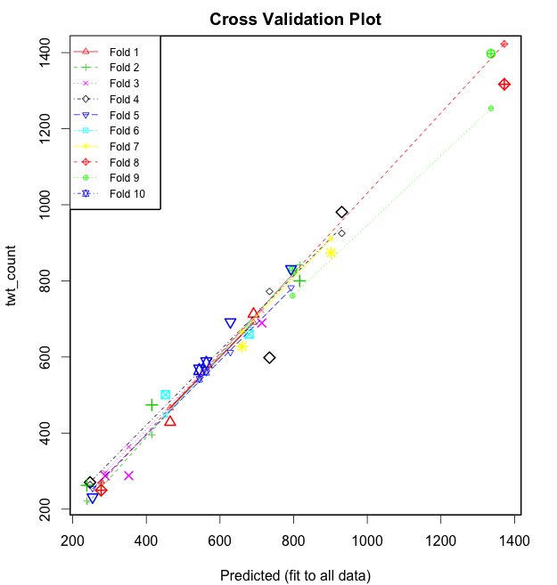
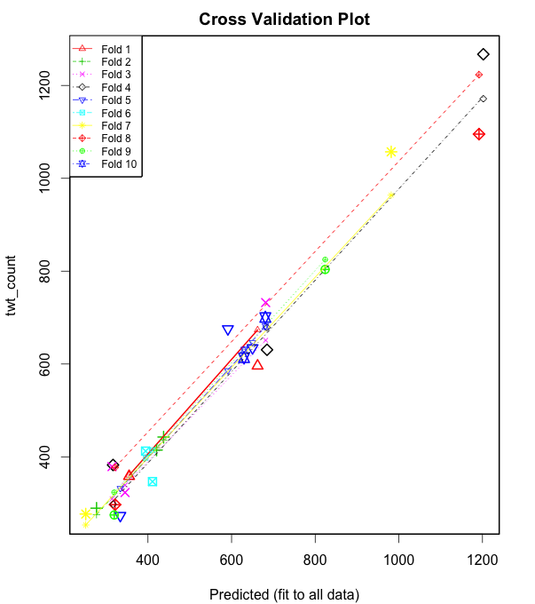

===================
Question 4
===================

::

  python was used for data parsing and R Statistical language was used for data
  and regression analysis

Cross Validation Over The Entire Periods
========================================

We perform a k-fold cross validation using the ``cv.lm()`` function in the
``DAAG`` package in R. Results for a 10 k-fold cross-validation are generated by
executing the following command on our data in R: ::

  cv.lm(df=dat, fit, m=10) # 10 fold cross-validation

The results are shown below:

NFL Hashtag
-----------

::

	Analysis of Variance Table

	Response: twt_count
	          Df  Sum Sq Mean Sq F value Pr(>F)
	ret_cnt    1 2185260 2185260  830.87 <2e-16 ***
	accel      1    6452    6452    2.45  0.133
	peak       1   13132   13132    4.99  0.037 *
	Residuals 20   52602    2630
	---
	Signif. codes:  0 ‘***’ 0.001 ‘**’ 0.01 ‘*’ 0.05 ‘.’ 0.1 ‘ ’ 1

	fold 1
	Observations in test set: 2
	               20    23
	Predicted   464.7 691.2
	cvpred      466.0 690.4
	twt_count   428.5 713.0
	CV residual -37.5  22.6

	Sum of squares = 1913    Mean square = 957    n = 2

	fold 2
	Observations in test set: 3
	               14    21    24
	Predicted   816.4 415.0 238.5
	cvpred      841.9 395.5 220.9
	twt_count   799.9 473.8 262.5
	CV residual -42.1  78.4  41.6

	Sum of squares = 9638    Mean square = 3213    n = 3

	fold 3
	Observations in test set: 3
	                 5     6    18
	Predicted   288.39 352.3 713.7
	cvpred      295.64 364.1 722.1
	twt_count   287.43 288.0 689.3
	CV residual  -8.21 -76.1 -32.8

	Sum of squares = 6926    Mean square = 2309    n = 3

	fold 4
	Observations in test set: 3
	                 1    12   17
	Predicted   247.17 930.8  734
	cvpred      264.22 924.9  772
	twt_count   270.40 980.8  598
	CV residual   6.18  55.9 -174

	Sum of squares = 33433    Mean square = 11144    n = 3

	fold 5
	Observations in test set: 3
	                3    10    11
	Predicted   254.0 628.3 793.0
	cvpred      254.8 612.3 782.1
	twt_count   231.4 691.8 831.6
	CV residual -23.3  79.6  49.5

	Sum of squares = 9323    Mean square = 3108    n = 3

	fold 6
	Observations in test set: 2
	                7    22
	Predicted   452.0 679.2
	cvpred      447.7 682.8
	twt_count   500.8 660.0
	CV residual  53.1 -22.8

	Sum of squares = 3340    Mean square = 1670    n = 2

	fold 7
	Observations in test set: 2
	                2  15
	Predicted   660.1 902
	cvpred      666.0 911
	twt_count   627.2 874
	CV residual -38.8 -37

	Sum of squares = 2877    Mean square = 1439    n = 2

	fold 8
	Observations in test set: 2
	                4   13
	Predicted   277.4 1372
	cvpred      269.2 1423
	twt_count   249.7 1317
	CV residual -19.5 -106

	Sum of squares = 11609    Mean square = 5805    n = 2

	fold 9
	Observations in test set: 2
	                8   16
	Predicted   797.2 1336
	cvpred      761.1 1253
	twt_count   827.2 1397
	CV residual  66.1  144

	Sum of squares = 25073    Mean square = 12536    n = 2

	fold 10
	Observations in test set: 2
	                9    19
	Predicted   562.9 543.8
	cvpred      559.6 541.5
	twt_count   585.3 566.2
	CV residual  25.7  24.7

	Sum of squares = 1273    Mean square = 637    n = 2

	Overall (Sum over all 10 folds)
	  ms
	4392

Super Bowl Hashtag
------------------

::

	Analysis of Variance Table

	Response: twt_count
	          Df Sum Sq Mean Sq F value  Pr(>F)
	ret_cnt    1 564486  564486   194.2 9.3e-12 ***
	accel      1 970386  970386   333.9 6.0e-14 ***
	peak       1 225468  225468    77.6 2.6e-08 ***
	Residuals 20  58129    2906
	---
	Signif. codes:  0 ‘***’ 0.001 ‘**’ 0.01 ‘*’ 0.05 ‘.’ 0.1 ‘ ’ 1

	fold 1
	Observations in test set: 2
	               20     23
	Predicted   662.2 354.88
	cvpred      673.3 360.23
	twt_count   596.0 358.20
	CV residual -77.3  -2.03

	Sum of squares = 5974    Mean square = 2987    n = 2

	fold 2
	Observations in test set: 3
	                14     21    24
	Predicted   420.65 437.40 277.1
	cvpred      419.48 436.20 275.6
	twt_count   414.60 442.71 289.4
	CV residual  -4.88   6.51  13.8

	Sum of squares = 255    Mean square = 85.1    n = 3

	fold 3
	Observations in test set: 3
	                5     6    18
	Predicted   314.2 345.2 681.5
	cvpred      309.5 338.9 651.1
	twt_count   379.0 323.2 732.3
	CV residual  69.5 -15.7  81.2

	Sum of squares = 11679    Mean square = 3893    n = 3

	fold 4
	Observations in test set: 3
	                1     12    17
	Predicted   316.5 1202.0 684.8
	cvpred      298.1 1171.4 678.5
	twt_count   382.5 1267.2 630.6
	CV residual  84.4   95.8 -47.8

	Sum of squares = 18595    Mean square = 6198    n = 3

	fold 5
	Observations in test set: 3
	                3    10    11
	Predicted   333.9 591.2 650.1
	cvpred      332.2 585.9 646.5
	twt_count   273.4 675.5 634.6
	CV residual -58.8  89.6 -11.9

	Sum of squares = 11622    Mean square = 3874    n = 3

	fold 6
	Observations in test set: 2
	                7    22
	Predicted   410.9 394.3
	cvpred      414.5 397.7
	twt_count   346.7 412.3
	CV residual -67.8  14.6

	Sum of squares = 4808    Mean square = 2404    n = 2

	fold 7
	Observations in test set: 2
	                2     15
	Predicted   251.2  981.7
	cvpred      253.3  963.6
	twt_count   276.8 1057.0
	CV residual  23.6   93.4

	Sum of squares = 9283    Mean square = 4641    n = 2

	fold 8
	Observations in test set: 2
	                4   13
	Predicted   321.4 1192
	cvpred      377.2 1223
	twt_count   297.0 1095
	CV residual -80.2 -128

	Sum of squares = 22840    Mean square = 11420    n = 2

	fold 9
	Observations in test set: 2
	                8    16
	Predicted   319.3 823.7
	cvpred      323.6 825.0
	twt_count   274.8 803.7
	CV residual -48.8 -21.4

	Sum of squares = 2835    Mean square = 1417    n = 2

	fold 10
	Observations in test set: 2
	                9    19
	Predicted   680.7 629.8
	cvpred      680.6 630.1
	twt_count   700.2 613.4
	CV residual  19.5 -16.7

	Sum of squares = 662    Mean square = 331    n = 2

	Overall (Sum over all 2 folds)
	  ms
	3690

The above figure shows a plot of the cross validation results.

Cross Validation for Different Regression Models Based on Certain Periods
=========================================================================

We have divided the data for both NFL and Super bowl into three time frames as
follows:

1. Before Feb. 1, 8:00 a.m.
2. Between Feb. 1, 8:00 a.m. and 8:00 p.m.
3. After Feb. 1, 8:00 p.m.

For each data set, we build a regression model. A total of three regression
models are generated. Results for a ``summary(fit)`` command for each regression
model are shown below:

NFL Hashtag
-----------

::

	lm(formula = twt_count ~ ret_cnt + accel + peak, data = dat1)

	Residuals:
	   Min     1Q Median     3Q    Max
	-526.4  -77.9    2.2   43.1  729.4

	Coefficients:
	             Estimate Std. Error t value Pr(>|t|)
	(Intercept) -5.42e+00   4.39e+01   -0.12   0.9026
	ret_cnt      4.53e-01   3.51e-02   12.89  7.5e-15 ***
	accel        2.82e-01   9.69e-02    2.91   0.0063 **
	peak         6.88e-09   2.09e-09    3.28   0.0023 **
	---
	Signif. codes:  0 ‘***’ 0.001 ‘**’ 0.01 ‘*’ 0.05 ‘.’ 0.1 ‘ ’ 1

	Residual standard error: 231 on 35 degrees of freedom
	Multiple R-squared:  0.994,	Adjusted R-squared:  0.993
	F-statistic: 1.92e+03 on 3 and 35 DF,  p-value: <2e-16

::

	lm(formula = twt_count ~ ret_cnt + accel + peak, data = dat2)

	Residuals:
	   Min     1Q Median     3Q    Max
	-526.4  -77.9    2.2   43.1  729.4

	Coefficients:
	             Estimate Std. Error t value Pr(>|t|)
	(Intercept) -5.42e+00   4.39e+01   -0.12   0.9026
	ret_cnt      4.53e-01   3.51e-02   12.89  7.5e-15 ***
	accel        2.82e-01   9.69e-02    2.91   0.0063 **
	peak         6.88e-09   2.09e-09    3.28   0.0023 **
	---
	Signif. codes:  0 ‘***’ 0.001 ‘**’ 0.01 ‘*’ 0.05 ‘.’ 0.1 ‘ ’ 1

	Residual standard error: 231 on 35 degrees of freedom
	Multiple R-squared:  0.994,	Adjusted R-squared:  0.993
	F-statistic: 1.92e+03 on 3 and 35 DF,  p-value: <2e-16

::

	lm(formula = twt_count ~ ret_cnt + accel + peak, data = dat3)

	Residuals:
	   Min     1Q Median     3Q    Max
	-637.2  -36.6   11.4   60.9  272.5

	Coefficients:
	             Estimate Std. Error t value Pr(>|t|)
	(Intercept)  1.43e+02   1.63e+01    8.77  2.4e-14 ***
	ret_cnt      4.19e-01   4.06e-02   10.34  < 2e-16 ***
	accel       -9.76e-02   4.45e-02   -2.19     0.03 *
	peak         1.11e-08   2.20e-09    5.02  2.0e-06 ***
	---
	Signif. codes:  0 ‘***’ 0.001 ‘**’ 0.01 ‘*’ 0.05 ‘.’ 0.1 ‘ ’ 1

	Residual standard error: 121 on 111 degrees of freedom
	Multiple R-squared:     1,	Adjusted R-squared:     1
	F-statistic: 3.75e+05 on 3 and 111 DF,  p-value: <2e-16

Super Bowl Hashtag
------------------

::

	lm(formula = twt_count ~ ret_cnt + accel + peak, data = dat1)

	Residuals:
	    Min      1Q  Median      3Q     Max
	-1525.5  -157.1  -101.4    47.5  1466.6

	Coefficients:
	             Estimate Std. Error t value Pr(>|t|)
	(Intercept)  1.42e+02   1.10e+02    1.30  0.20759
	ret_cnt      1.12e+00   8.31e-02   13.49  2.1e-12 ***
	accel       -2.69e+00   6.16e-01   -4.37  0.00022 ***
	peak        -3.35e-08   4.28e-09   -7.83  6.2e-08 ***
	---
	Signif. codes:  0 ‘***’ 0.001 ‘**’ 0.01 ‘*’ 0.05 ‘.’ 0.1 ‘ ’ 1

	Residual standard error: 511 on 23 degrees of freedom
	Multiple R-squared:  0.996,	Adjusted R-squared:  0.995
	F-statistic: 1.84e+03 on 3 and 23 DF,  p-value: <2e-16

::

	lm(formula = twt_count ~ ret_cnt + accel + peak, data = dat2)

	Residuals:
	   Min     1Q Median     3Q    Max
	 -1775   -161   -105    108   1245

	Coefficients:
	             Estimate Std. Error t value Pr(>|t|)
	(Intercept)  1.50e+02   1.14e+02    1.32  0.20079
	ret_cnt      1.07e+00   7.96e-02   13.40  1.2e-12 ***
	accel       -2.29e+00   5.88e-01   -3.89  0.00069 ***
	peak        -3.09e-08   4.13e-09   -7.47  1.0e-07 ***
	---
	Signif. codes:  0 ‘***’ 0.001 ‘**’ 0.01 ‘*’ 0.05 ‘.’ 0.1 ‘ ’ 1

	Residual standard error: 530 on 24 degrees of freedom
	Multiple R-squared:  0.995,	Adjusted R-squared:  0.995
	F-statistic: 1.7e+03 on 3 and 24 DF,  p-value: <2e-16

::

	lm(formula = twt_count ~ ret_cnt + accel + peak, data = dat3)

	Residuals:
	   Min     1Q Median     3Q    Max
	 -4874    -59     21    110   5618

	Coefficients:
	             Estimate Std. Error t value Pr(>|t|)
	(Intercept)  6.10e+01   7.23e+01    0.84    0.401
	ret_cnt      2.68e-01   2.73e-02    9.84  < 2e-16 ***
	accel       -2.95e-02   1.74e-02   -1.69    0.093 .
	peak         6.48e-09   1.14e-09    5.70  9.8e-08 ***
	---
	Signif. codes:  0 ‘***’ 0.001 ‘**’ 0.01 ‘*’ 0.05 ‘.’ 0.1 ‘ ’ 1

	Residual standard error: 756 on 113 degrees of freedom
	Multiple R-squared:     1,	Adjusted R-squared:     1
	F-statistic: 7.02e+05 on 3 and 113 DF,  p-value: <2e-16