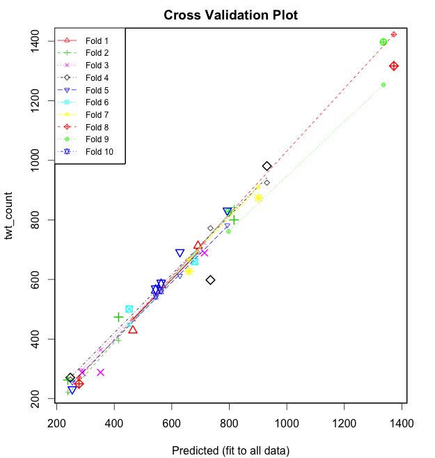

===================
Question 4
===================

::

  python was used for data parsing and R Statistical language was used for data
  and regression analysis

Cross Validation Over The Entire Periods
========================================

We perform a k-fold cross validation using the ``cv.lm()`` function in the
``DAAG`` package in R. Results for a 10 k-fold cross-validation are generated by
executing the following command on our data in R: ::

  cv.lm(df=dat, fit, m=10) # 10 fold cross-validation

The results are shown below: ::

	Analysis of Variance Table

	Response: twt_count
	          Df  Sum Sq Mean Sq F value Pr(>F)
	ret_cnt    1 2185260 2185260  830.87 <2e-16 ***
	accel      1    6452    6452    2.45  0.133
	peak       1   13132   13132    4.99  0.037 *
	Residuals 20   52602    2630
	---
	Signif. codes:  0 ‘***’ 0.001 ‘**’ 0.01 ‘*’ 0.05 ‘.’ 0.1 ‘ ’ 1

	fold 1
	Observations in test set: 2
	               20    23
	Predicted   464.7 691.2
	cvpred      466.0 690.4
	twt_count   428.5 713.0
	CV residual -37.5  22.6

	Sum of squares = 1913    Mean square = 957    n = 2

	fold 2
	Observations in test set: 3
	               14    21    24
	Predicted   816.4 415.0 238.5
	cvpred      841.9 395.5 220.9
	twt_count   799.9 473.8 262.5
	CV residual -42.1  78.4  41.6

	Sum of squares = 9638    Mean square = 3213    n = 3

	fold 3
	Observations in test set: 3
	                 5     6    18
	Predicted   288.39 352.3 713.7
	cvpred      295.64 364.1 722.1
	twt_count   287.43 288.0 689.3
	CV residual  -8.21 -76.1 -32.8

	Sum of squares = 6926    Mean square = 2309    n = 3

	fold 4
	Observations in test set: 3
	                 1    12   17
	Predicted   247.17 930.8  734
	cvpred      264.22 924.9  772
	twt_count   270.40 980.8  598
	CV residual   6.18  55.9 -174

	Sum of squares = 33433    Mean square = 11144    n = 3

	fold 5
	Observations in test set: 3
	                3    10    11
	Predicted   254.0 628.3 793.0
	cvpred      254.8 612.3 782.1
	twt_count   231.4 691.8 831.6
	CV residual -23.3  79.6  49.5

	Sum of squares = 9323    Mean square = 3108    n = 3

	fold 6
	Observations in test set: 2
	                7    22
	Predicted   452.0 679.2
	cvpred      447.7 682.8
	twt_count   500.8 660.0
	CV residual  53.1 -22.8

	Sum of squares = 3340    Mean square = 1670    n = 2

	fold 7
	Observations in test set: 2
	                2  15
	Predicted   660.1 902
	cvpred      666.0 911
	twt_count   627.2 874
	CV residual -38.8 -37

	Sum of squares = 2877    Mean square = 1439    n = 2

	fold 8
	Observations in test set: 2
	                4   13
	Predicted   277.4 1372
	cvpred      269.2 1423
	twt_count   249.7 1317
	CV residual -19.5 -106

	Sum of squares = 11609    Mean square = 5805    n = 2

	fold 9
	Observations in test set: 2
	                8   16
	Predicted   797.2 1336
	cvpred      761.1 1253
	twt_count   827.2 1397
	CV residual  66.1  144

	Sum of squares = 25073    Mean square = 12536    n = 2

	fold 10
	Observations in test set: 2
	                9    19
	Predicted   562.9 543.8
	cvpred      559.6 541.5
	twt_count   585.3 566.2
	CV residual  25.7  24.7

	Sum of squares = 1273    Mean square = 637    n = 2

	Overall (Sum over all 10 folds)
	  ms
	4392

The above figure shows a plot of the cross validation results.

WE WILL INSER MORE TEXT LATER HERE

Cross Validation for Different Regression Models Based on Certain Periods
=========================================================================

