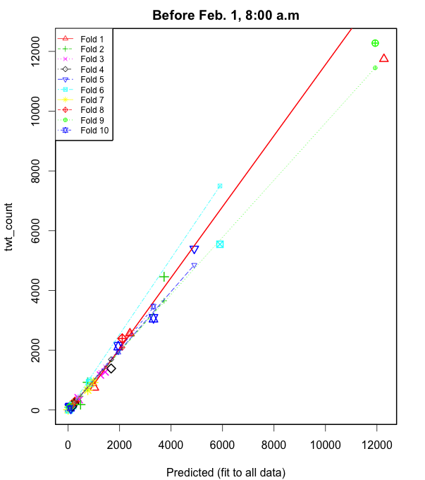
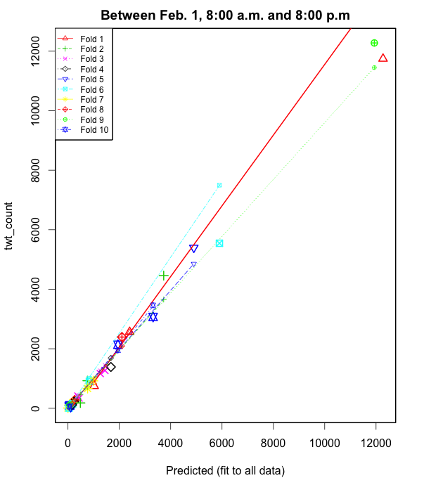
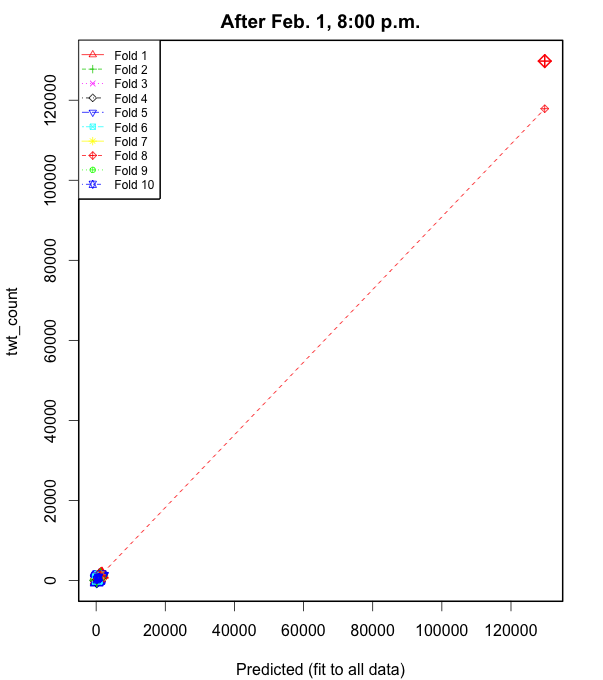
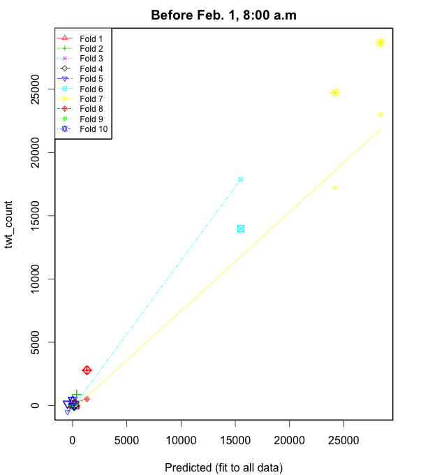
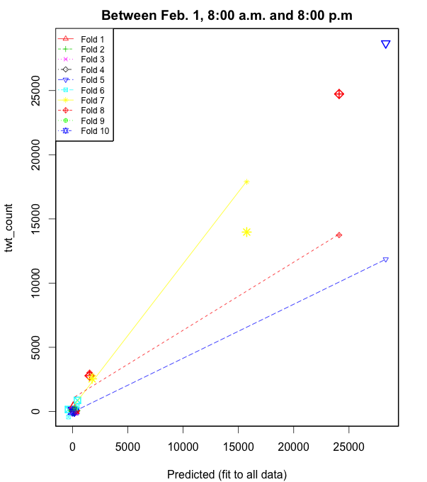
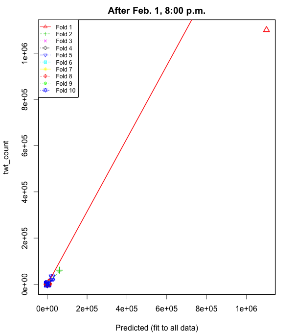

===================
Question 4
===================

::

  python was used for data parsing and R Statistical language was used for data
  and regression analysis

Cross Validation Over The Entire Periods
========================================

We perform a k-fold cross validation using the ``cv.lm()`` function in the
``DAAG`` package in R. Results for a 10 k-fold cross-validation are generated by
executing the following command on our data in R: ::

  cv.lm(df=dat, fit, m=10) # 10 fold cross-validation

The results are shown below:

NFL Hashtag
-----------

::

	Analysis of Variance Table

	Response: twt_count
	          Df  Sum Sq Mean Sq F value Pr(>F)
	ret_cnt    1 2185260 2185260  830.87 <2e-16 ***
	accel      1    6452    6452    2.45  0.133
	peak       1   13132   13132    4.99  0.037 *
	Residuals 20   52602    2630
	---
	Signif. codes:  0 ‘***’ 0.001 ‘**’ 0.01 ‘*’ 0.05 ‘.’ 0.1 ‘ ’ 1

	fold 1
	Observations in test set: 2
	               20    23
	Predicted   464.7 691.2
	cvpred      466.0 690.4
	twt_count   428.5 713.0
	CV residual -37.5  22.6

	Sum of squares = 1913    Mean square = 957    n = 2

	fold 2
	Observations in test set: 3
	               14    21    24
	Predicted   816.4 415.0 238.5
	cvpred      841.9 395.5 220.9
	twt_count   799.9 473.8 262.5
	CV residual -42.1  78.4  41.6

	Sum of squares = 9638    Mean square = 3213    n = 3

	fold 3
	Observations in test set: 3
	                 5     6    18
	Predicted   288.39 352.3 713.7
	cvpred      295.64 364.1 722.1
	twt_count   287.43 288.0 689.3
	CV residual  -8.21 -76.1 -32.8

	Sum of squares = 6926    Mean square = 2309    n = 3

	fold 4
	Observations in test set: 3
	                 1    12   17
	Predicted   247.17 930.8  734
	cvpred      264.22 924.9  772
	twt_count   270.40 980.8  598
	CV residual   6.18  55.9 -174

	Sum of squares = 33433    Mean square = 11144    n = 3

	fold 5
	Observations in test set: 3
	                3    10    11
	Predicted   254.0 628.3 793.0
	cvpred      254.8 612.3 782.1
	twt_count   231.4 691.8 831.6
	CV residual -23.3  79.6  49.5

	Sum of squares = 9323    Mean square = 3108    n = 3

	fold 6
	Observations in test set: 2
	                7    22
	Predicted   452.0 679.2
	cvpred      447.7 682.8
	twt_count   500.8 660.0
	CV residual  53.1 -22.8

	Sum of squares = 3340    Mean square = 1670    n = 2

	fold 7
	Observations in test set: 2
	                2  15
	Predicted   660.1 902
	cvpred      666.0 911
	twt_count   627.2 874
	CV residual -38.8 -37

	Sum of squares = 2877    Mean square = 1439    n = 2

	fold 8
	Observations in test set: 2
	                4   13
	Predicted   277.4 1372
	cvpred      269.2 1423
	twt_count   249.7 1317
	CV residual -19.5 -106

	Sum of squares = 11609    Mean square = 5805    n = 2

	fold 9
	Observations in test set: 2
	                8   16
	Predicted   797.2 1336
	cvpred      761.1 1253
	twt_count   827.2 1397
	CV residual  66.1  144

	Sum of squares = 25073    Mean square = 12536    n = 2

	fold 10
	Observations in test set: 2
	                9    19
	Predicted   562.9 543.8
	cvpred      559.6 541.5
	twt_count   585.3 566.2
	CV residual  25.7  24.7

	Sum of squares = 1273    Mean square = 637    n = 2

	Overall (Sum over all 10 folds)
	  ms
	4392

.. image:: img/q4_NFL_plot.png
   :height: 600

Super Bowl Hashtag
------------------

::

	Analysis of Variance Table

	Response: twt_count
	          Df Sum Sq Mean Sq F value  Pr(>F)
	ret_cnt    1 564486  564486   194.2 9.3e-12 ***
	accel      1 970386  970386   333.9 6.0e-14 ***
	peak       1 225468  225468    77.6 2.6e-08 ***
	Residuals 20  58129    2906
	---
	Signif. codes:  0 ‘***’ 0.001 ‘**’ 0.01 ‘*’ 0.05 ‘.’ 0.1 ‘ ’ 1

	fold 1
	Observations in test set: 2
	               20     23
	Predicted   662.2 354.88
	cvpred      673.3 360.23
	twt_count   596.0 358.20
	CV residual -77.3  -2.03

	Sum of squares = 5974    Mean square = 2987    n = 2

	fold 2
	Observations in test set: 3
	                14     21    24
	Predicted   420.65 437.40 277.1
	cvpred      419.48 436.20 275.6
	twt_count   414.60 442.71 289.4
	CV residual  -4.88   6.51  13.8

	Sum of squares = 255    Mean square = 85.1    n = 3

	fold 3
	Observations in test set: 3
	                5     6    18
	Predicted   314.2 345.2 681.5
	cvpred      309.5 338.9 651.1
	twt_count   379.0 323.2 732.3
	CV residual  69.5 -15.7  81.2

	Sum of squares = 11679    Mean square = 3893    n = 3

	fold 4
	Observations in test set: 3
	                1     12    17
	Predicted   316.5 1202.0 684.8
	cvpred      298.1 1171.4 678.5
	twt_count   382.5 1267.2 630.6
	CV residual  84.4   95.8 -47.8

	Sum of squares = 18595    Mean square = 6198    n = 3

	fold 5
	Observations in test set: 3
	                3    10    11
	Predicted   333.9 591.2 650.1
	cvpred      332.2 585.9 646.5
	twt_count   273.4 675.5 634.6
	CV residual -58.8  89.6 -11.9

	Sum of squares = 11622    Mean square = 3874    n = 3

	fold 6
	Observations in test set: 2
	                7    22
	Predicted   410.9 394.3
	cvpred      414.5 397.7
	twt_count   346.7 412.3
	CV residual -67.8  14.6

	Sum of squares = 4808    Mean square = 2404    n = 2

	fold 7
	Observations in test set: 2
	                2     15
	Predicted   251.2  981.7
	cvpred      253.3  963.6
	twt_count   276.8 1057.0
	CV residual  23.6   93.4

	Sum of squares = 9283    Mean square = 4641    n = 2

	fold 8
	Observations in test set: 2
	                4   13
	Predicted   321.4 1192
	cvpred      377.2 1223
	twt_count   297.0 1095
	CV residual -80.2 -128

	Sum of squares = 22840    Mean square = 11420    n = 2

	fold 9
	Observations in test set: 2
	                8    16
	Predicted   319.3 823.7
	cvpred      323.6 825.0
	twt_count   274.8 803.7
	CV residual -48.8 -21.4

	Sum of squares = 2835    Mean square = 1417    n = 2

	fold 10
	Observations in test set: 2
	                9    19
	Predicted   680.7 629.8
	cvpred      680.6 630.1
	twt_count   700.2 613.4
	CV residual  19.5 -16.7

	Sum of squares = 662    Mean square = 331    n = 2

	Overall (Sum over all 2 folds)
	  ms
	3690

.. image:: img/q4_superbowl_plot.png
   :height: 600

The above figure shows a plot of the cross validation results.

Cross Validation for Different Regression Models Based on Certain Periods
=========================================================================

We have divided the data for both NFL and Super bowl into three time frames as
follows:

1. Before Feb. 1, 8:00 a.m.
2. Between Feb. 1, 8:00 a.m. and 8:00 p.m.
3. After Feb. 1, 8:00 p.m.

For each data set, we build a regression model. A total of three regression
models are generated. Results for a ``summary(fit)`` command for each regression
model are shown below as well as cross validation results for each time frame

NFL Hashtag
-----------

::

	lm(formula = twt_count ~ ret_cnt + accel + peak, data = dat1)

	Residuals:
	   Min     1Q Median     3Q    Max
	-526.4  -77.9    2.2   43.1  729.4

	Coefficients:
	             Estimate Std. Error t value Pr(>|t|)
	(Intercept) -5.42e+00   4.39e+01   -0.12   0.9026
	ret_cnt      4.53e-01   3.51e-02   12.89  7.5e-15 ***
	accel        2.82e-01   9.69e-02    2.91   0.0063 **
	peak         6.88e-09   2.09e-09    3.28   0.0023 **
	---
	Signif. codes:  0 ‘***’ 0.001 ‘**’ 0.01 ‘*’ 0.05 ‘.’ 0.1 ‘ ’ 1

	Residual standard error: 231 on 35 degrees of freedom
	Multiple R-squared:  0.994,	Adjusted R-squared:  0.993
	F-statistic: 1.92e+03 on 3 and 35 DF,  p-value: <2e-16

::

	lm(formula = twt_count ~ ret_cnt + accel + peak, data = dat2)

	Residuals:
	   Min     1Q Median     3Q    Max
	-526.4  -77.9    2.2   43.1  729.4

	Coefficients:
	             Estimate Std. Error t value Pr(>|t|)
	(Intercept) -5.42e+00   4.39e+01   -0.12   0.9026
	ret_cnt      4.53e-01   3.51e-02   12.89  7.5e-15 ***
	accel        2.82e-01   9.69e-02    2.91   0.0063 **
	peak         6.88e-09   2.09e-09    3.28   0.0023 **
	---
	Signif. codes:  0 ‘***’ 0.001 ‘**’ 0.01 ‘*’ 0.05 ‘.’ 0.1 ‘ ’ 1

	Residual standard error: 231 on 35 degrees of freedom
	Multiple R-squared:  0.994,	Adjusted R-squared:  0.993
	F-statistic: 1.92e+03 on 3 and 35 DF,  p-value: <2e-16

::

	lm(formula = twt_count ~ ret_cnt + accel + peak, data = dat3)

	Residuals:
	   Min     1Q Median     3Q    Max
	-637.2  -36.6   11.4   60.9  272.5

	Coefficients:
	             Estimate Std. Error t value Pr(>|t|)
	(Intercept)  1.43e+02   1.63e+01    8.77  2.4e-14 ***
	ret_cnt      4.19e-01   4.06e-02   10.34  < 2e-16 ***
	accel       -9.76e-02   4.45e-02   -2.19     0.03 *
	peak         1.11e-08   2.20e-09    5.02  2.0e-06 ***
	---
	Signif. codes:  0 ‘***’ 0.001 ‘**’ 0.01 ‘*’ 0.05 ‘.’ 0.1 ‘ ’ 1

	Residual standard error: 121 on 111 degrees of freedom
	Multiple R-squared:     1,	Adjusted R-squared:     1
	F-statistic: 3.75e+05 on 3 and 111 DF,  p-value: <2e-16

Cross Validation Resuts for the NFL hashtag
"""""""""""""""""""""""""""""""""""""""""""

Before Feb 1 8:00am
+++++++++++++++++++

::

	Analysis of Variance Table

	Response: twt_count
	          Df   Sum Sq  Mean Sq F value  Pr(>F)
	ret_cnt    1 3.06e+08 3.06e+08  5734.2 < 2e-16 ***
	accel      1 7.21e+05 7.21e+05    13.5 0.00079 ***
	peak       1 5.75e+05 5.75e+05    10.8 0.00234 **
	Residuals 35 1.87e+06 5.33e+04
	---
	Signif. codes:  0 ‘***’ 0.001 ‘**’ 0.01 ‘*’ 0.05 ‘.’ 0.1 ‘ ’ 1

	fold 1
	Observations in test set: 3
	                 21   13    38
	Predicted   2401.33 1019 12272
	cvpred      2554.32  862 14251
	twt_count   2563.00  747 11746
	CV residual    8.68 -115 -2505

	Sum of squares = 6286698    Mean square = 2095566    n = 3

	fold 2
	Observations in test set: 4
	              32   39  19    9
	Predicted   50.5 3729 758  482
	cvpred      28.6 3656 722  462
	twt_count   87.0 4458 926  179
	CV residual 58.4  802 204 -283

	Sum of squares = 768637    Mean square = 192159    n = 4

	fold 3
	Observations in test set: 4
	              22   26   16     7
	Predicted    434 1440 1257 384.6
	cvpred       444 1449 1268 394.6
	twt_count    343 1270 1167 412.0
	CV residual -101 -179 -101  17.4

	Sum of squares = 52631    Mean square = 13158    n = 4

	fold 4
	Observations in test set: 4
	               24     3   17    10
	Predicted   236.0 234.7 1671 158.6
	cvpred      246.4 246.2 1691 170.1
	twt_count   226.0 220.0 1388 114.0
	CV residual -20.4 -26.2 -303 -56.1

	Sum of squares = 96366    Mean square = 24091    n = 4

	fold 5
	Observations in test set: 4
	               30    34   6   20
	Predicted    44.3 139.0 106 4901
	cvpred       41.4 139.1 101 4855
	twt_count   101.0  90.0  41 5397
	CV residual  59.6 -49.1 -60  542

	Sum of squares = 302951    Mean square = 75738    n = 4

	fold 6
	Observations in test set: 4
	                1    18     8   27
	Predicted    40.6  5899 178.9  833
	cvpred       66.8  7497 205.4 1011
	twt_count     7.0  5546 146.0  905
	CV residual -59.8 -1951 -59.4 -106

	Sum of squares = 3824707    Mean square = 956177    n = 4

	fold 7
	Observations in test set: 4
	               36   14      4    37
	Predicted   -0.89  764 188.80 986.7
	cvpred       4.81  770 194.68 991.6
	twt_count    9.00  664 191.00 921.0
	CV residual  4.19 -106  -3.68 -70.6

	Sum of squares = 16323    Mean square = 4081    n = 4

	fold 8
	Observations in test set: 4
	               23     25  12   28
	Predicted   162.7 128.27 258 2102
	cvpred      153.4 119.25 250 2092
	twt_count   186.0 112.00 273 2393
	CV residual  32.6  -7.25  23  301

	Sum of squares = 92492    Mean square = 23123    n = 4

	fold 9
	Observations in test set: 4
	               33     2     5     29
	Predicted   47.32 11934 121.2  67.54
	cvpred      94.53 11451 151.2 104.33
	twt_count   97.00 12277 139.0  96.00
	CV residual  2.47   826 -12.2  -8.33

	Sum of squares = 682944    Mean square = 170736    n = 4

	fold 10
	Observations in test set: 4
	               31   35   11   15
	Predicted    74.9 58.5 1946 3316
	cvpred       72.5 46.2 1946 3463
	twt_count   100.0 85.0 2135 3069
	CV residual  27.5 38.8  189 -394

	Sum of squares = 193330    Mean square = 48332    n = 4

	Overall (Sum over all 4 folds)
	    ms
	315823

Between Feb 1 8:00am to 8:00pm
++++++++++++++++++++++++++++++

::

	Analysis of Variance Table

	Response: twt_count
	          Df   Sum Sq  Mean Sq F value  Pr(>F)
	ret_cnt    1 3.06e+08 3.06e+08  5734.2 < 2e-16 ***
	accel      1 7.21e+05 7.21e+05    13.5 0.00079 ***
	peak       1 5.75e+05 5.75e+05    10.8 0.00234 **
	Residuals 35 1.87e+06 5.33e+04
	---
	Signif. codes:  0 ‘***’ 0.001 ‘**’ 0.01 ‘*’ 0.05 ‘.’ 0.1 ‘ ’ 1

	fold 1
	Observations in test set: 3
	                 21   13    38
	Predicted   2401.33 1019 12272
	cvpred      2554.32  862 14251
	twt_count   2563.00  747 11746
	CV residual    8.68 -115 -2505

	Sum of squares = 6286698    Mean square = 2095566    n = 3

	fold 2
	Observations in test set: 4
	              32   39  19    9
	Predicted   50.5 3729 758  482
	cvpred      28.6 3656 722  462
	twt_count   87.0 4458 926  179
	CV residual 58.4  802 204 -283

	Sum of squares = 768637    Mean square = 192159    n = 4

	fold 3
	Observations in test set: 4
	              22   26   16     7
	Predicted    434 1440 1257 384.6
	cvpred       444 1449 1268 394.6
	twt_count    343 1270 1167 412.0
	CV residual -101 -179 -101  17.4

	Sum of squares = 52631    Mean square = 13158    n = 4

	fold 4
	Observations in test set: 4
	               24     3   17    10
	Predicted   236.0 234.7 1671 158.6
	cvpred      246.4 246.2 1691 170.1
	twt_count   226.0 220.0 1388 114.0
	CV residual -20.4 -26.2 -303 -56.1

	Sum of squares = 96366    Mean square = 24091    n = 4

	fold 5
	Observations in test set: 4
	               30    34   6   20
	Predicted    44.3 139.0 106 4901
	cvpred       41.4 139.1 101 4855
	twt_count   101.0  90.0  41 5397
	CV residual  59.6 -49.1 -60  542

	Sum of squares = 302951    Mean square = 75738    n = 4

	fold 6
	Observations in test set: 4
	                1    18     8   27
	Predicted    40.6  5899 178.9  833
	cvpred       66.8  7497 205.4 1011
	twt_count     7.0  5546 146.0  905
	CV residual -59.8 -1951 -59.4 -106

	Sum of squares = 3824707    Mean square = 956177    n = 4

	fold 7
	Observations in test set: 4
	               36   14      4    37
	Predicted   -0.89  764 188.80 986.7
	cvpred       4.81  770 194.68 991.6
	twt_count    9.00  664 191.00 921.0
	CV residual  4.19 -106  -3.68 -70.6

	Sum of squares = 16323    Mean square = 4081    n = 4

	fold 8
	Observations in test set: 4
	               23     25  12   28
	Predicted   162.7 128.27 258 2102
	cvpred      153.4 119.25 250 2092
	twt_count   186.0 112.00 273 2393
	CV residual  32.6  -7.25  23  301

	Sum of squares = 92492    Mean square = 23123    n = 4

	fold 9
	Observations in test set: 4
	               33     2     5     29
	Predicted   47.32 11934 121.2  67.54
	cvpred      94.53 11451 151.2 104.33
	twt_count   97.00 12277 139.0  96.00
	CV residual  2.47   826 -12.2  -8.33

	Sum of squares = 682944    Mean square = 170736    n = 4

	fold 10
	Observations in test set: 4
	               31   35   11   15
	Predicted    74.9 58.5 1946 3316
	cvpred       72.5 46.2 1946 3463
	twt_count   100.0 85.0 2135 3069
	CV residual  27.5 38.8  189 -394

	Sum of squares = 193330    Mean square = 48332    n = 4

	Overall (Sum over all 4 folds)
	    ms
	315823

After 8:00pm
++++++++++++

::

	Analysis of Variance Table

	Response: twt_count
	           Df   Sum Sq  Mean Sq  F value Pr(>F)
	ret_cnt     1 1.66e+10 1.66e+10 1.12e+06 <2e-16 ***
	accel       1 2.25e+03 2.25e+03 1.50e-01    0.7
	peak        1 3.71e+05 3.71e+05 2.52e+01  2e-06 ***
	Residuals 111 1.63e+06 1.47e+04
	---
	Signif. codes:  0 ‘***’ 0.001 ‘**’ 0.01 ‘*’ 0.05 ‘.’ 0.1 ‘ ’ 1

	fold 1
	Observations in test set: 11
	             152    61   109   110    88    137   43    93    94    75 146
	Predicted    144 684.3 500.8 480.6 837.8 1141.8 1679 674.3 747.9 479.2 490
	cvpred       143 689.6 497.6 476.8 840.2 1134.6 1689 677.8 747.9 475.5 478
	twt_count      1 713.0 550.0 540.0 933.0 1210.0 1523 658.0 779.0 494.0 712
	CV residual -142  23.4  52.4  63.2  92.8   75.4 -166 -19.8  31.1  18.5 234

	Sum of squares = 125906    Mean square = 11446    n = 11

	fold 2
	Observations in test set: 12
	               80   104   128    58  154   135    136     46     70  50    52   149
	Predicted   265.6 251.4 326.9 481.1  145 731.0  917.3 1300.4  999.7 782 771.3 212.6
	cvpred      269.3 254.3 331.1 485.6  150 732.9  920.4 1304.8 1001.6 784 775.4 216.3
	twt_count   222.0 244.0 305.0 395.0    3 827.0 1005.0 1327.0 1021.0 771 706.0 141.0
	CV residual -47.3 -10.3 -26.1 -90.6 -147  94.1   84.6   22.2   19.4 -13 -69.4 -75.3

	Sum of squares = 60376    Mean square = 5031    n = 12

	fold 3
	Observations in test set: 12
	               55  150   64   114     68   139   141    72    97    51    99 147
	Predicted   335.4  144  871 778.5 1008.4 864.9 614.4 677.4 517.0 704.3 344.1 338
	cvpred      330.3  145  865 770.2 1007.7 871.1 610.7 675.2 513.8 704.4 342.9 332
	twt_count   411.0    1 1021 758.0  951.0 777.0 693.0 747.0 539.0 775.0 271.0 428
	CV residual  80.7 -144  156 -12.2  -56.7 -94.1  82.3  71.8  25.2  70.6 -71.9  96

	Sum of squares = 95820    Mean square = 7985    n = 12

	fold 4
	Observations in test set: 12
	               57   106  60   108   132  153 113   138  95     73  144    76
	Predicted   368.3 289.8 687 355.9 701.0  144 655 952.6 483 460.61  759 407.5
	cvpred      370.5 293.1 691 357.3 703.4  149 658 951.1 483 465.76  761 409.5
	twt_count   419.0 246.0 647 375.0 691.0    2 638 977.0 520 457.00  619 499.0
	CV residual  48.5 -47.1 -44  17.7 -12.4 -147 -20  25.9  37  -8.76 -142  89.5

	Sum of squares = 59264    Mean square = 4939    n = 12

	fold 5
	Observations in test set: 12
	              127   105   130   131    85  117   47  118   48    96   121   148
	Predicted   285.6 259.8 384.4 308.5 496.6 1092 1724  763 1151 485.6 291.3 316.9
	cvpred      283.2 255.2 389.7 307.2 500.4 1125 1962  835 1176 506.3 297.9 318.6
	twt_count   257.0 218.0 406.0 254.0 541.0 1364 1087  621  949 548.0 266.0 306.0
	CV residual -26.2 -37.2  16.3 -53.2  40.6  239 -875 -214 -227  41.7 -31.9 -12.6

	Sum of squares = 930474    Mean square = 77540    n = 12

	fold 6
	Observations in test set: 12
	              103    56    81    83   107  89   42   49 145   122    54   125
	Predicted   315.7 324.8 267.4 346.8 356.7 679 1329  899 549 487.3 396.5 280.7
	cvpred      312.7 317.5 262.2 343.2 350.8 675 1339  896 543 481.2 391.3 278.2
	twt_count   263.0 377.0 247.0 354.0 416.0 780 1228 1045 667 477.0 468.0 258.0
	CV residual -49.7  59.5 -15.2  10.8  65.2 105 -111  149 124  -4.2  76.7 -20.2

	Sum of squares = 78005    Mean square = 6500    n = 12

	fold 7
	Observations in test set: 11
	              129    59   63    87      111   134   112   44   140    71   101
	Predicted   333.7 533.4 1057 753.5 630.6230 677.2 590.0 1452 796.3 733.0 366.4
	cvpred      338.5 530.5 1073 763.8 640.0774 676.2 597.7 1524 804.9 753.5 358.6
	twt_count   301.0 518.0 1048 780.0 640.0000 768.0 616.0 1231 855.0 716.0 411.0
	CV residual -37.5 -12.5  -25  16.2  -0.0774  91.8  18.3 -293  50.1 -37.5  52.4

	Sum of squares = 103731    Mean square = 9430    n = 11

	fold 8
	Observations in test set: 11
	               126    84    62  86     41     66   91   116   45 100    77
	Predicted   289.83 370.4 740.7 607 129767  988.6 1132 464.9 1325 572 348.3
	cvpred      300.02 404.6 724.2 603 117876 1017.2 1162 456.2 1351 577 352.4
	twt_count   295.00 426.0 797.0 745 129773  972.0  586 492.0 1501 711 368.0
	CV residual  -5.02  21.4  72.8 142  11897  -45.2 -576  35.8  150 134  15.6

	Sum of squares = 1.42e+08    Mean square = 12902847    n = 11

	fold 9
	Observations in test set: 11
	                79    82 133   67   69   142   120    74    53  78   102
	Predicted   276.29 294.1 635  882  753 512.5 504.4 271.7 541.9 285 285.4
	cvpred      273.95 289.1 630  859  755 510.3 492.6 272.7 529.2 283 283.8
	twt_count   282.00 273.0 744 1092  650 604.0 591.0 212.0 595.0 296 316.0
	CV residual   8.05 -16.1 114  233 -105  93.7  98.4 -60.7  65.8  13  32.2

	Sum of squares = 106180    Mean square = 9653    n = 11

	fold 10
	Observations in test set: 11
	             151   40   65    90   115     92  119 143    98   123   124
	Predicted    145  637  868 640.6 663.7 762.79  678 607 496.7 392.2 238.4
	cvpred       163  675  846 641.3 674.9 767.41  735 595 514.8 391.5 247.5
	twt_count      2  404 1071 736.0 701.0 761.00  545 698 476.0 450.0 205.0
	CV residual -161 -271  225  94.7  26.1  -6.41 -190 103 -38.8  58.5 -42.5

	Sum of squares = 213134    Mean square = 19376    n = 11

	Overall (Sum over all 11 folds)
	     ms
	1249602

Super Bowl Hashtag
------------------

::

	lm(formula = twt_count ~ ret_cnt + accel + peak, data = dat1)

	Residuals:
	    Min      1Q  Median      3Q     Max
	-1525.5  -157.1  -101.4    47.5  1466.6

	Coefficients:
	             Estimate Std. Error t value Pr(>|t|)
	(Intercept)  1.42e+02   1.10e+02    1.30  0.20759
	ret_cnt      1.12e+00   8.31e-02   13.49  2.1e-12 ***
	accel       -2.69e+00   6.16e-01   -4.37  0.00022 ***
	peak        -3.35e-08   4.28e-09   -7.83  6.2e-08 ***
	---
	Signif. codes:  0 ‘***’ 0.001 ‘**’ 0.01 ‘*’ 0.05 ‘.’ 0.1 ‘ ’ 1

	Residual standard error: 511 on 23 degrees of freedom
	Multiple R-squared:  0.996,	Adjusted R-squared:  0.995
	F-statistic: 1.84e+03 on 3 and 23 DF,  p-value: <2e-16

::

	lm(formula = twt_count ~ ret_cnt + accel + peak, data = dat2)

	Residuals:
	   Min     1Q Median     3Q    Max
	 -1775   -161   -105    108   1245

	Coefficients:
	             Estimate Std. Error t value Pr(>|t|)
	(Intercept)  1.50e+02   1.14e+02    1.32  0.20079
	ret_cnt      1.07e+00   7.96e-02   13.40  1.2e-12 ***
	accel       -2.29e+00   5.88e-01   -3.89  0.00069 ***
	peak        -3.09e-08   4.13e-09   -7.47  1.0e-07 ***
	---
	Signif. codes:  0 ‘***’ 0.001 ‘**’ 0.01 ‘*’ 0.05 ‘.’ 0.1 ‘ ’ 1

	Residual standard error: 530 on 24 degrees of freedom
	Multiple R-squared:  0.995,	Adjusted R-squared:  0.995
	F-statistic: 1.7e+03 on 3 and 24 DF,  p-value: <2e-16

::

	lm(formula = twt_count ~ ret_cnt + accel + peak, data = dat3)

	Residuals:
	   Min     1Q Median     3Q    Max
	 -4874    -59     21    110   5618

	Coefficients:
	             Estimate Std. Error t value Pr(>|t|)
	(Intercept)  6.10e+01   7.23e+01    0.84    0.401
	ret_cnt      2.68e-01   2.73e-02    9.84  < 2e-16 ***
	accel       -2.95e-02   1.74e-02   -1.69    0.093 .
	peak         6.48e-09   1.14e-09    5.70  9.8e-08 ***
	---
	Signif. codes:  0 ‘***’ 0.001 ‘**’ 0.01 ‘*’ 0.05 ‘.’ 0.1 ‘ ’ 1

	Residual standard error: 756 on 113 degrees of freedom
	Multiple R-squared:     1,	Adjusted R-squared:     1
	F-statistic: 7.02e+05 on 3 and 113 DF,  p-value: <2e-16

Cross Validation Resuts for the SuperBowl hashtag
"""""""""""""""""""""""""""""""""""""""""""""""""

Before Feb 1 8:00am
+++++++++++++++++++

::

	Analysis of Variance Table

	Response: twt_count
	          Df   Sum Sq  Mean Sq F value  Pr(>F)
	ret_cnt    1 1.42e+09 1.42e+09  5434.0 < 2e-16 ***
	accel      1 2.77e+06 2.77e+06    10.6  0.0035 **
	peak       1 1.60e+07 1.60e+07    61.4 6.2e-08 ***
	Residuals 23 6.01e+06 2.61e+05
	---
	Signif. codes:  0 ‘***’ 0.001 ‘**’ 0.01 ‘*’ 0.05 ‘.’ 0.1 ‘ ’ 1

	fold 1
	Observations in test set: 2
	               13   15
	Predicted   38.99  257
	cvpred      47.12  267
	twt_count   49.00   70
	CV residual  1.88 -197

	Sum of squares = 38813    Mean square = 19407    n = 2

	fold 2
	Observations in test set: 3
	               9  24    20
	Predicted    203 376  77.5
	cvpred       193 353  64.8
	twt_count     57 868  52.0
	CV residual -136 515 -12.8

	Sum of squares = 283541    Mean square = 94514    n = 3

	fold 3
	Observations in test set: 3
	              10   18     2
	Predicted    171  194  32.3
	cvpred       187  210  47.9
	twt_count     46   38   7.0
	CV residual -141 -172 -40.9

	Sum of squares = 51166    Mean square = 17055    n = 3

	fold 4
	Observations in test set: 3
	               3   17   21
	Predicted    144  148  163
	cvpred       164  167  183
	twt_count      1   62   17
	CV residual -163 -105 -166

	Sum of squares = 65512    Mean square = 21837    n = 3

	fold 5
	Observations in test set: 3
	              22     1    16
	Predicted   -469 102.4 120.8
	cvpred      -519  87.8 106.1
	twt_count    154   1.0  46.0
	CV residual  673 -86.8 -60.1

	Sum of squares = 463819    Mean square = 154606    n = 3

	fold 6
	Observations in test set: 3
	              7    11    27
	Predicted   198 285.1 15501
	cvpred       66 136.1 17877
	twt_count    29  65.0 13976
	CV residual -37 -71.1 -3901

	Sum of squares = 15222231    Mean square = 5074077    n = 3

	fold 7
	Observations in test set: 3
	               26    19    25
	Predicted   24183 206.1 28363
	cvpred      17175  35.2 23012
	twt_count   24733  47.0 28680
	CV residual  7558  11.8  5668

	Sum of squares = 89257472    Mean square = 29752491    n = 3

	fold 8
	Observations in test set: 3
	               4    5   12
	Predicted   1321  228  212
	cvpred       513  297  251
	twt_count   2788   13   62
	CV residual 2275 -284 -189

	Sum of squares = 5289782    Mean square = 1763261    n = 3

	fold 9
	Observations in test set: 2
	                6     8
	Predicted   -56.9 130.9
	cvpred      -57.1 131.2
	twt_count    28.0  47.0
	CV residual  85.1 -84.2

	Sum of squares = 14330    Mean square = 7165    n = 2

	fold 10
	Observations in test set: 2
	                23   14
	Predicted     7.98  195
	cvpred       -5.99  190
	twt_count   362.00   37
	CV residual 367.99 -153

	Sum of squares = 158751    Mean square = 79375    n = 2

	Overall (Sum over all 2 folds)
	     ms
	4105386

Between Feb 1 8:00am and 8:00pm
+++++++++++++++++++++++++++++++

::

	Analysis of Variance Table

	Response: twt_count
	          Df   Sum Sq  Mean Sq F value Pr(>F)
	ret_cnt    1 1.42e+09 1.42e+09 5047.23 <2e-16 ***
	accel      1 2.49e+06 2.49e+06    8.85 0.0066 **
	peak       1 1.57e+07 1.57e+07   55.86  1e-07 ***
	Residuals 24 6.75e+06 2.81e+05
	---
	Signif. codes:  0 ‘***’ 0.001 ‘**’ 0.01 ‘*’ 0.05 ‘.’ 0.1 ‘ ’ 1

	fold 1
	Observations in test set: 2
	               23   14
	Predicted    73.0  202
	cvpred       64.6  199
	twt_count   362.0   37
	CV residual 297.4 -162

	Sum of squares = 114696    Mean square = 57348    n = 2

	fold 2
	Observations in test set: 3
	               13   15    20
	Predicted    68.1  253  96.1
	cvpred       79.9  267 108.7
	twt_count    49.0   70  52.0
	CV residual -30.9 -197 -56.7

	Sum of squares = 43075    Mean square = 14358    n = 3

	fold 3
	Observations in test set: 3
	               9   18     2
	Predicted    210  199  50.8
	cvpred       229  218  68.9
	twt_count     57   38   7.0
	CV residual -172 -180 -61.9

	Sum of squares = 65855    Mean square = 21952    n = 3

	fold 4
	Observations in test set: 3
	               3   10   17
	Predicted    152  178  159
	cvpred       172  198  179
	twt_count      1   46   62
	CV residual -171 -152 -117

	Sum of squares = 66005    Mean square = 22002    n = 3

	fold 5
	Observations in test set: 3
	               16    25    21
	Predicted   132.1 28325 169.8
	cvpred      -31.8 11855  45.2
	twt_count    46.0 28680  17.0
	CV residual  77.8 16825 -28.2

	Sum of squares = 2.83e+08    Mean square = 94361662    n = 3

	fold 6
	Observations in test set: 3
	              22   11  24
	Predicted   -372  287 443
	cvpred      -433  266 395
	twt_count    154   65 868
	CV residual  587 -201 473

	Sum of squares = 608421    Mean square = 202807    n = 3

	fold 7
	Observations in test set: 3
	                7    27   28
	Predicted   202.9 15751 1769
	cvpred       62.2 17884 2845
	twt_count    29.0 13976 2544
	CV residual -33.2 -3908 -301

	Sum of squares = 15366511    Mean square = 5122170    n = 3

	fold 8
	Observations in test set: 3
	               4    26    19
	Predicted   1543 24108 210.4
	cvpred      3029 13743  17.6
	twt_count   2788 24733  47.0
	CV residual -241 10990  29.4

	Sum of squares = 1.21e+08    Mean square = 40283300    n = 3

	fold 9
	Observations in test set: 3
	               5   12    1
	Predicted    222  213  113
	cvpred       250  240  139
	twt_count     13   62    1
	CV residual -237 -178 -138

	Sum of squares = 106861    Mean square = 35620    n = 3

	fold 10
	Observations in test set: 2
	                6     8
	Predicted   -20.3 141.8
	cvpred      -18.3 144.2
	twt_count    28.0  47.0
	CV residual  46.3 -97.2

	Sum of squares = 11600    Mean square = 5800    n = 2

After Feb 1 8:00pm
++++++++++++++++++

::

	Analysis of Variance Table

	Response: twt_count
	           Df   Sum Sq  Mean Sq  F value  Pr(>F)
	ret_cnt     1 1.20e+12 1.20e+12 2.11e+06 < 2e-16 ***
	accel       1 3.71e+07 3.71e+07 6.50e+01 8.7e-13 ***
	peak        1 1.85e+07 1.85e+07 3.25e+01 9.8e-08 ***
	Residuals 113 6.45e+07 5.71e+05
	---
	Signif. codes:  0 ‘***’ 0.001 ‘**’ 0.01 ‘*’ 0.05 ‘.’ 0.1 ‘ ’ 1

	fold 1
	Observations in test set: 11
	             73   53      32   56    34   58   131  62   40   88    29
	Predicted   274 2468 1101249 1308  4567  754 211.7 454 1941  301  7416
	cvpred      194 2373 1737837 1729  5285  576 284.9 413 2592  427  9400
	twt_count   407 2882 1101154 1390  4056 1049 245.0 638 2207  302  7919
	CV residual 213  509 -636683 -339 -1229  473 -39.9 225 -385 -125 -1481

	Sum of squares = 4.05e+11    Mean square = 3.69e+10    n = 11

	fold 2
	Observations in test set: 12
	             70     121    143   52  124    31    79 102   103   36   59   130
	Predicted   343 175.475   61.8  108  470 60859 634.7 631 347.3 4364 1073 279.4
	cvpred      387 220.758  127.9  168  539 56371 637.9 621 369.4 4052 1090 327.5
	twt_count   560 221.000    2.0   34  368 61132 643.0 819 396.0 3680  771 258.0
	CV residual 173   0.242 -125.9 -134 -171  4761   5.1 198  26.6 -372 -319 -69.5

	Sum of squares = 2.3e+07    Mean square = 1920407    n = 12

	fold 3
	Observations in test set: 12
	              45      94    95   118 127    81    35   84     87   111   41   42
	Predicted   1111 130.998 196.4 170.8 328 381.3  5762  617 273.32 226.6 1491  949
	cvpred      1136 143.283 208.3 183.4 339 390.2  5808  632 283.36 239.4 1501  958
	twt_count    881 143.000 141.0 155.0 441 418.0  3792  401 291.00 185.0 1741 1277
	CV residual -255  -0.283 -67.3 -28.4 102  27.8 -2016 -231   7.64 -54.4  240  319

	Sum of squares = 4360508    Mean square = 363376    n = 12

	fold 4
	Observations in test set: 12
	              72    97  74  78   106  107   38   63    134  64    90    91
	Predicted    500 160.8 334 482 265.9  400 3311  670 195.80 232 265.2 160.5
	cvpred       508 168.9 343 490 274.1  410 3324  680 204.72 241 273.3 168.6
	twt_count    349 181.0 497 619 253.0  279 2568  435 207.00 227 238.0 215.0
	CV residual -159  12.1 154 129 -21.1 -131 -756 -245   2.28 -14 -35.3  46.4

	Sum of squares = 718194    Mean square = 59850    n = 12

	fold 5
	Observations in test set: 12
	              140   145   57 104   128   105  60   135    89   137 114   139
	Predicted    61.6  61.8 1078 343 294.2 326.1 661 219.0 256.9 115.1 107  74.0
	cvpred       60.0  60.2 1076 341 292.5 324.5 659 217.5 255.1 113.5 105  72.4
	twt_count     2.0   3.0 1243 477 315.0 285.0 709 239.0 276.0 140.0  48  23.0
	CV residual -58.0 -57.2  167 136  22.5 -39.5  50  21.5  20.9  26.5 -57 -49.4

	Sum of squares = 64646    Mean square = 5387    n = 12

	fold 6
	Observations in test set: 12
	               48   49   120    98   51    75    99 100   108   39   112  66
	Predicted    5668  724 134.7 178.3 1158 486.9 278.0 317 225.2 3054 152.0 429
	cvpred       9428  917 151.3 214.9 1048 488.6 322.2 262 281.9 3156 191.4 460
	twt_count     794  810 118.0 241.0 1153 529.0 256.0 307 256.0 2371 206.0 618
	CV residual -8634 -107 -33.3  26.1  105  40.4 -66.2  45 -25.9 -785  14.6 158

	Sum of squares = 75224031    Mean square = 6268669    n = 12

	fold 7
	Observations in test set: 12
	              117   47    71   141   119   142    77  82  61    85    86 133
	Predicted   131.5 1010 234.9  61.3 124.2  61.6 610.0 403 611 305.4 303.7 333
	cvpred      128.3 1008 231.7  58.1 121.1  58.3 605.2 400 607 301.6 300.5 329
	twt_count   145.0  753 317.0   1.0 156.0   2.0 627.0 503 724 345.0 353.0 566
	CV residual  16.7 -255  85.3 -57.1  34.9 -56.3  21.8 103 117  43.4  52.5 237

	Sum of squares = 165744    Mean square = 13812    n = 12

	fold 8
	Observations in test set: 12
	               93  46    96   122   55   126  80   129 110    138  44   115
	Predicted   166.5 699 257.9 223.6 1131 396.6 484 386.6 134 131.36 595 124.1
	cvpred      161.2 694 252.7 218.3 1125 391.4 479 381.4 129 126.06 590 118.8
	twt_count   173.0 810 184.0 303.0 1329 336.0 594 328.0 160 130.00 817  93.0
	CV residual  11.8 116 -68.7  84.7  204 -55.4 115 -53.4  31   3.94 227 -25.8

	Sum of squares = 139583    Mean square = 11632    n = 12

	fold 9
	Observations in test set: 11
	               69   116   50   123   101   54    83   109   43  68    92
	Predicted   198.5 173.6 1087 427.8 243.5 1120 469.7 198.1 1183 193 135.9
	cvpred      193.4 168.8 1083 423.2 238.2 1114 464.3 193.3 1180 188 131.5
	twt_count   286.0 190.0  965 357.0 274.0 1719 406.0 231.0  947 327 187.0
	CV residual  92.6  21.2 -118 -66.2  35.8  605 -58.3  37.7 -233 139  55.5

	Sum of squares = 476459    Mean square = 43314    n = 11

	fold 10
	Observations in test set: 11
	               30   144  76   125   33     37 132    65   136   113  67
	Predicted   23660  62.1 487 249.7 4340 4181.8 171 468.7 168.5 150.7 289
	cvpred      19689  27.5 437 257.8 5341 3199.8 117 494.4 144.8 113.1 206
	twt_count   29278   4.0 647 307.0 4717 3118.0 237 588.0 229.0 184.0 451
	CV residual  9589 -23.5 210  49.2 -624  -81.8 120  93.6  84.2  70.9 245

	Sum of squares = 92479813    Mean square = 8407256    n = 11

	Overall (Sum over all 11 folds)
	      ms
	3.47e+09

